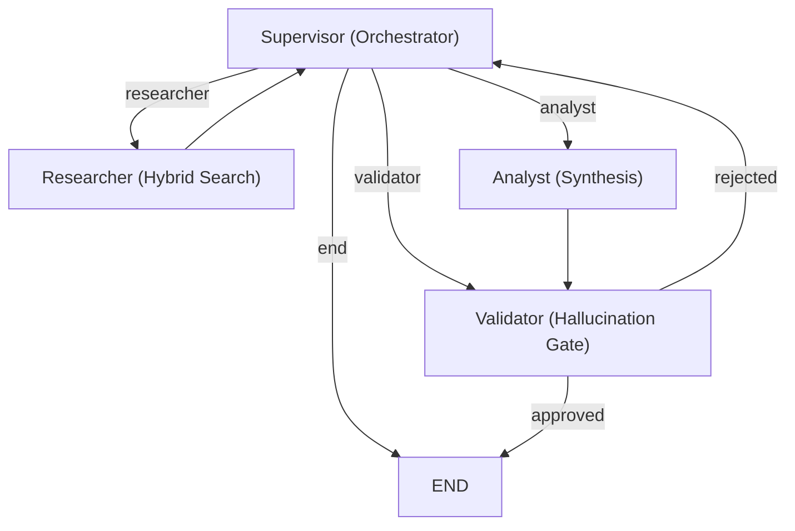

> **[🚀 Launch Live Demo](https://project-nexus.duckdns.org/)**  &nbsp;|&nbsp;  **[📁 View Source](https://github.com/bellerophon95/nexus)**
>
> **143 commits. 8 active days. Zero to production on AWS.**  
> Solo-built from a blank repository to a deployed, multi-agent AI platform — including three hosting pivots in 48 hours.

---

## The Problem

Traditional RAG systems are often "black boxes" — they retrieve documents and generate answers with no transparency into *why* a specific piece of context was chosen or whether the final answer is actually grounded in truth. This lack of observability makes them unsuitable for high-stakes research or decision support.

**Nexus solves this through Agentic RAG.** It shifts from a simple "retrieve-then-generate" pipeline to a self-correcting, multi-agent loop where every reasoning step is observable and every hallucination is caught before it reaches the user.



---

## Build Sprint: The 8-Day Timeline

Nexus wasn't built over months of casual study; it was a high-velocity sprint from zero to a production-grade AWS environment.

| Day | Focus | Key Milestone |
|---|---|---|
| **1** | **Core Platform** | Built full-stack monorepo (FastAPI + Next.js). First deployment attempt on Railway. |
| **1-2** | **Infra Pivots** | **Railway → Render → AWS.** Pivoted across three hosting platforms in 48 hours to solve dependency and RAM constraints. |
| **3** | **Feature Sprint** | Knowledge Hub, Agent Flow observability, shadow auth, and Self-RAG gate live on AWS. |
| **4** | **Expert Skills** | Implemented **Radial Discovery** skill hub and high-speed async ingestion pipeline. |
| **5** | **Optimization** | Swapped to **Cohere Rerank** for cost efficiency; implemented pre-commit stabilization. |
| **6-8** | **Production Hardening** | Caddy reverse proxy, memory optimization, ingestion worker resilience, and Next.js 15 migration. |

### The Deployment War Story

The most critical signal in the Nexus commit history isn't just the features, but the **resilience of the deployment**. 

On Day 1, the platform was targeted for **Railway**, but hit immediate dependency conflicts between LangChain and Unstructured on their Metal builder. Within the same calendar day, the project was pivoted to **Render**, where it hit RAM starvation and port-scan timeouts on the free tier. By Day 2, I had provisioned **AWS VPC/EC2 via Terraform**, configured a **Caddy** reverse proxy, and stabilized the production environment for ~$15/month — proving the ability to adapt infrastructure under pressure.

---

## Architectural Deep Dive: The Agent Quartet

Nexus is orchestrated by a **LangGraph** state machine. Unlike static chains, Nexus utilizes a **Supervisor** node to dynamically route tasks between specialized agents based on the evolving state of the research.

### The Agents
- **Supervisor** — The LLM-driven orchestrator. Manages state transitions and decides when the research satisfies the user's intent.
- **Researcher** — Executes hybrid search (Dense + Sparse) and integrates expert personas via **Radial Discovery**.
- **Analyst** — Synthesizes hundreds of context tokens into professional, cited responses.
- **Validator** — The "Hallucination Gate." Fact-checks the Analyst's draft against source documents before approval.



---

## 9-Stage Query Pipeline

Every query in Nexus passes through a strictly orchestrated pipeline, optimized for speed, cost, and safety.

1. **Input Guardrail** — Profanity and restricted topic detection.
2. **Semantic Cache** — Upstash Redis check for near-duplicate queries.
3. **Skill Orchestration** — Semantic retrieval of expert personas (Radial Discovery).
4. **Hybrid Retrieval** — Qdrant Dense Vector + Supabase BM25 Sparse search.
5. **Cohere Reranking** — Cross-Encoder reranking via `rerank-english-v3.0` for maximum precision.
6. **LangGraph Agent DAG** — Multi-turn agentic reasoning and self-correction.
7. **Output Guardrail** — Presidio PII detection and Self-RAG score enforcement.
8. **LLM Judge Evaluation** — 6-dimension scoring (Faithfulness, Relevance, etc.).
9. **SSE Stream Response** — Token-by-token streaming with live metrics.



---

## Production Engineering: The Hallucination Gate

The **Validator agent** uses a structured `Self-RAG` pipeline to ensure every claim is grounded.

**The Logic**:
- Factual claims are extracted and compared against source passages.
- **Hallucination Score > 0.5** → Response is **BLOCKED**.
- **Hallucination Score ≤ 0.5** → Response passes with a `WARNING` badge.
- Technical failures in validation default to **Fail-Closed** (Unsafe).



---

## Engineering for Scale: The $15/Month Production Cloud

Most AI projects run only locally due to high RAM requirements. Nexus was architected from day one to be **Production-Grade on a Budget**, running entirely on an AWS **t3.small** (2GB RAM).

### Cost Optimizations
- **API-First Reranking**: Moved from a 1.5GB local Cross-Encoder to the **Cohere Rerank API**, freeing 700MB of RAM.
- **LLM-as-Validator**: Replaced a local NLI model with `gpt-4o-mini`, identifying hallucinations for ~$0.10 per 1,000 runs while saving another 1.5GB of RAM.
- **Infrastructure as Code**: Managed via **Terraform** (VPC, ECR, EC2) with a zero-downtime **GitHub Actions** CI/CD pipeline.

---

## Infrastructure Stack

| Layer | Technology |
|---|---|
| **Frontend** | Next.js 15, React 19, Tailwind CSS |
| **Backend** | Python 3.12, FastAPI, LangGraph |
| **Search** | Qdrant Cloud (Hybrid), Cohere Rerank |
| **Observability** | Langfuse (Tracing, Evals, Cost Tracking) |
| **Safety** | Microsoft Presidio, Self-RAG Gates |
| **DevOps** | AWS, Terraform, Docker, GitHub Actions |



---

## Why This Matters

Nexus represents the shift from **Simple RAG** (generative hope) to **Applied AI Engineering** (verifiable proof). By surfacing the "hidden" reasoning of agents and enforcing strict cost/safety guardrails, it provides a blueprint for trustworthy, production-ready AI systems.

For the full technical breakdown, explore the [**GitHub Repository**](https://github.com/bellerophon95/nexus).
