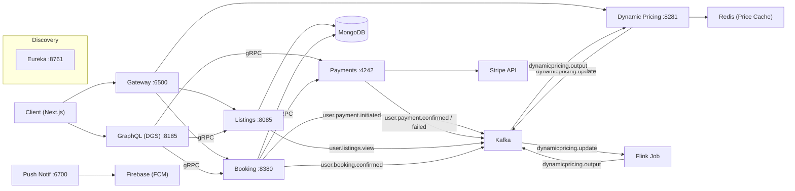
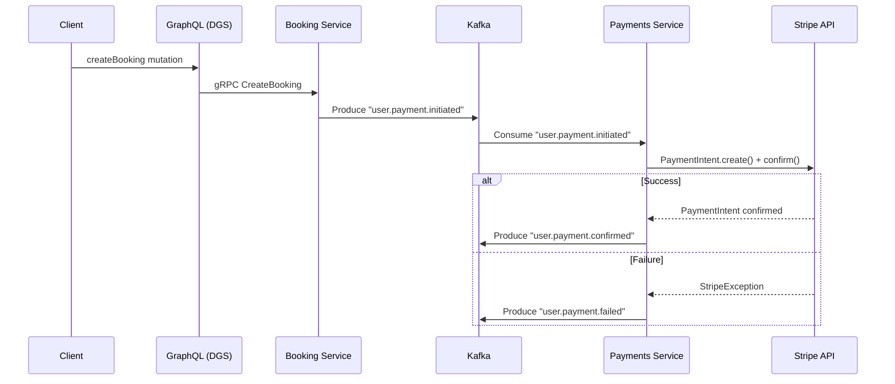

+++
draft = false
title = "Project Rentaroost"
date = 2024-07-31T16:29:49+05:30
description = "A production-grade reactive microservices platform for rental transactions, featuring Kafka choreography and Flink pricing intelligence."
tags = ["Choreography", "Kafka", "Flink", "Java", "Spring Boot", "GraphQL", "Netflix DGS", "gRPC"]
+++

> **[📁 View Source](https://github.com/bellerophon95/rentaroost)**

---

## High-Performance Event-Driven Real Estate Ecosystem

Rentaroost is a specialized microservices platform designed for high-concurrency rental transactions. Moving beyond simple CRUD, it implements a **Choreographed Saga Pattern** for distributed consistency and utilizes **Apache Flink** for real-time pricing intelligence based on live demand signals.

## Full System Topology

The ecosystem consists of 9 specialized services communicating via gRPC for synchronous retrieval and Kafka for asynchronous choreography.

---

## Core Engineering Achievements

| Layer | Technical Implementation | Impact |
|---|---|---|
| **API Layer** | GraphQL (DGS) + gRPC | Polyglot API: Typed Graph queries for external consumers; high-speed binary gRPC for internal reads. |
| **Consistency** | Kafka Choreography | Decoupled Saga flow managing payments and bookings without a central orchestrator bottleneck. |
| **Intelligence** | Apache Flink | Real-time demand-sensing using 30-minute sliding event-time windows and out-of-order watermark handling. |
| **Persistence** | Reactive MongoDB | Non-blocking data access for property and booking metadata. |
| **Edge Logic** | Spring Cloud Gateway | Aggregated routing and dynamic pricing proxies for front-end consumers. |

---

## Deep Dive: Kafka Event Choreography

Unlike traditional centralized orchestration, Rentaroost uses **Choreography**. Each service reacts independently to events on the Kafka bus, ensuring higher scalability and looser coupling.

**Key Flow: Booking & Payment Consistency**
1. **Booking Service** emits `user.payment.initiated`.
2. **Payment Service** consumes event, calls Stripe API, and emits `user.payment.confirmed`.
3. **Booking Service** finalizes state and triggers FCM push notifications.

---

## Deep Dive: Flink Dynamic Pricing Engine

The system uses **Apache Flink** to compute real-time price adjustments based on demand signals. This is a legitimate data engineering pipeline, not just a backend calculation.

- **Deduplication**: Per-window deduping by `userID + eventType` to prevent price manipulation.
- **Algorithm State**:
    - `Booking_Impact`: +10% multiplier per unique booking event.
    - `View_Impact`: +5% multiplier per unique view event.
- **Consistency**: 30-second bounded out-of-orderness watermarks ensure late-arriving events are correctly calculated before the 1-minute slide triggers.
- **Caching**: Results are pushed to **Redis** with a 30-minute rolling TTL, ensuring the "hot" demand price decays back to base price automatically.

---

## Infrastructure

The architecture is designed for **cloud-native scalability**. While the repo provides a complete `docker-compose.yaml` for local development (including Zookeeper, Kafka, and Flink), the production design targets managed services like Confluent and Managed Flink to handle industrial-scale rental traffic.

For a deeper look into the implementation, visit the [**GitHub Repository**](https://github.com/bellerophon95/rentaroost).
