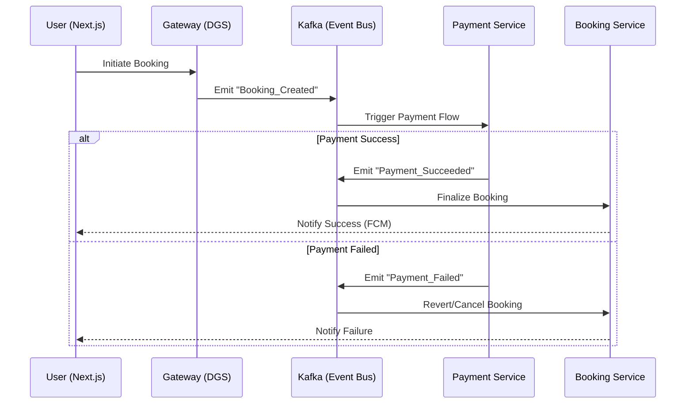

+++
draft = false
title = "Project Rentaroost"
date = 2024-07-31T16:29:49+05:30
description = "A high-performance real-estate SaaS ecosystem built on a reactive, event-driven architecture and Saga orchestration."
tags = ["Saga Pattern", "Kafka", "Flink", "Java", "Spring Boot", "GraphQL", "Netflix DGS"]
+++

> **[📁 View Source](https://github.com/bellerophon95/rentaroost)**

---

## High-Performance Event-Driven Real Estate Ecosystem

Rentaroost is a production-grade real-estate SaaS platform designed for high concurrency and complex transactional consistency. Instead of a traditional monolithic approach, it utilizes a **Reactive Microservices** architecture to handle millions of property listings and real-time booking flows.

## Core Engineering Achievements

| Layer | Technology | Key Impact |
|---|---|---|
| **API Layer** | GraphQL + Netflix DGS | Efficient data fetching with typed safety and rapid schema evolution. |
| **Orchestration** | Apache Kafka (Saga Pattern) | Ensures distributed transactional consistency across payments and bookings using non-blocking WebFlux. |
| **Stream Processing** | Apache Flink | Real-time dynamic pricing calculation with watermark-aware windowing. |
| **Data Logic** | gRPC + CQRS | Unary synchronous gRPC for high-speed read queries, strictly separated from write flows. |
| **Caching** | Redis (Hashes + Pub/Sub) | Real-time price drop notifications and TTL-based dynamic pricing deltas. |

---

## The Architecture: Saga Orchestration

To maintain consistency without the overhead of 2PC, Rentaroost implements the **Saga Pattern** via Apache Kafka. This ensures that every booking flow is either fully completed or gracefully compensated across the Payment, Booking, and Listing services.

---

## Key Technical Features

### 1. Dynamic Pricing Engine
Utilizes **Apache Flink** to process event streams (views and bookings). The engine accounts for out-of-order events using watermarks and applies dynamic multipliers to the base property price, stored in high-performance Redis Hashes.

### 2. Reactive Write Flows
All state-changing operations are handled via **Spring WebFlux** and Kafka, ensuring that the system remains responsive even under heavy write loads.

### 3. Distributed Observability
The architecture is designed for transparency, with plans to integrate Apache Druid for deep pricing analytics and service health monitoring.

---

## Conclusion

Rentaroost demonstrates the power of modern distributed systems—moving beyond simple CRUD to handle the complexities of real-world scale, concurrency, and reliability in a cloud-native environment.

For more technical details, please explore the [GitHub repository](https://github.com/bellerophon95/rentaroost).
